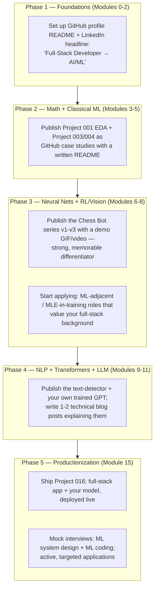

# Career Transition: Full-Stack Web Developer → AI/ML Developer

Context: coming from Java/Node.js + React/Angular full-stack development,
targeting an AI/ML developer role. This isn't a "learn to code" plan — you can
already code, ship, and deploy. It's a plan to (1) pick up the ML-specific
knowledge, (2) prove it with real projects, and (3) translate your existing
strengths into a differentiated candidacy instead of competing as a generic
beginner.

## Your existing skills already transfer

| You already know | Maps to |
|---|---|
| REST APIs, Express/Spring controllers | Serving a model behind an endpoint (lesson 078) is the same shape, different payload |
| npm/Maven dependency management | pip/venv (lesson 001) — same problem, different tool |
| Git workflows, code review, CI | Same expectations apply to ML repos; most self-taught ML learners are weaker here than you |
| Docker/deployment (if you've done any) | Lesson 079–080 — packaging a model is packaging a service |
| React/Angular | Build a real frontend for your ML projects (Project 016) — most ML portfolios are notebooks with no UI; a working demo app stands out |
| Debugging production issues | Debugging a training run that diverges or a model that underperforms is the same discipline, applied to different failure modes |

**Don't discard this.** A candidate who can both train a model *and* ship it
behind a working full-stack app is rarer and more hireable than either skill
alone.

## Don't wait until the end to start the career-side work

Portfolio, resume, and networking should run **in parallel** with the
technical curriculum, not after it — each phase below has a concrete
publish/share action tied to work you'll already have done.

## Portfolio checklist (per project, not just at the end)

- A README that reads like a case study: problem → approach → results →
  what you'd do differently — not just "here's the code."
- For classical ML projects (001, 003, 004, 005): include your data-quality
  decisions and *why*, not just final metrics — this is what real ML work
  looks like day to day.
- For the Chess Bot (008–010) and the custom LLM (013): a short demo
  (GIF, video, or a live deployed link via Project 016's app) — visual proof
  beats a metrics table for getting attention.
- Pin your 3–4 strongest repos on your GitHub profile; don't rely on someone
  scrolling through all of them.

## Interview prep — what's actually different from web dev interviews

- **ML system design** (lesson 081): "design a recommendation system / fraud
  detector / content moderation pipeline" — analogous to system design
  interviews you may have already done, but the bottlenecks are data,
  labeling, drift, and evaluation instead of database sharding.
- **ML/DS coding** (lesson 082): still DSA-adjacent, plus ML-specific asks
  (implement k-means, implement backprop for a tiny network, vectorize an
  operation in NumPy). Lessons 025–038 are direct practice for these.
- **Take-home/portfolio review**: unlike many web dev interviews, ML
  interviewers frequently just want you to walk through a real project —
  which is exactly why the portfolio checklist above matters.

## Reference links

**Roadmaps & career-focused courses**

- [roadmap.sh — AI Engineer](https://roadmap.sh/ai-engineer)
- [Full Stack Deep Learning](https://fullstackdeeplearning.com/) — a course literally aimed at developers who can already build software, teaching the ML-specific gap
- [Made With ML](https://madewithml.com/) — MLOps and production ML practices
- [Machine Learning Engineering for Production (MLOps) Specialization — DeepLearning.AI](https://www.deeplearning.ai/courses/machine-learning-engineering-for-production-mlops/)

**Interview prep**

- [Chip Huyen — Machine Learning Interviews Book (free, GitHub)](https://github.com/chiphuyen/ml-interviews-book)
- [Chip Huyen — Designing Machine Learning Systems (book)](https://huyenchip.com/books/) — the standard reference for ML system design interviews

**Portfolio & practice**

- [Kaggle](https://www.kaggle.com/) — competitions and public notebooks double as portfolio pieces
- [eugeneyan/applied-ml (GitHub)](https://github.com/eugeneyan/applied-ml) — curated papers/write-ups on how real companies actually use ML, good interview-answer material and blog-post inspiration

**General AI/ML roadmap references** — see [README.md](README.md#road-map-reference) for the broader curated list this repo already tracks.
