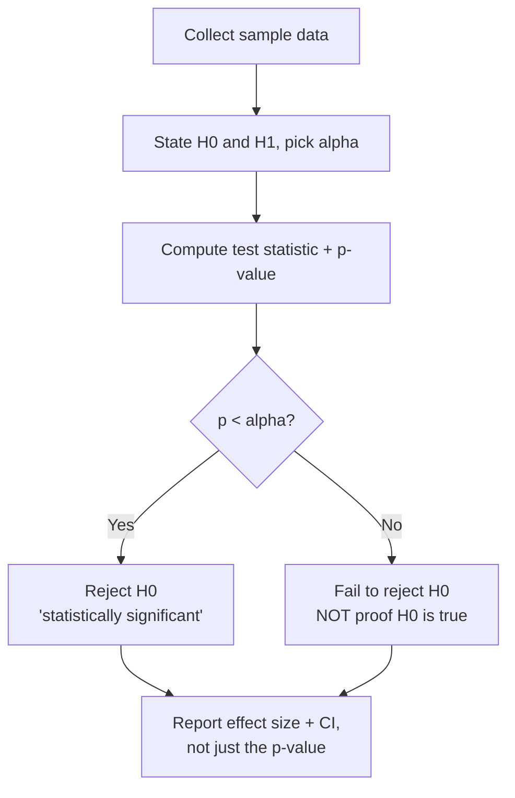

# 01 — Concepts: Inferential Statistics & Hypothesis Testing

## Population vs sample

The **population** is everything you'd want to know about (every user, every
possible game position); a **sample** is the subset you actually collected
data for. Inferential statistics is the machinery for making justified claims
about a population from a sample, with an honest accounting of uncertainty —
exactly the situation you're in every time you evaluate a model on a test set
and want to claim something about how it'll perform on new, unseen data.

## Sampling distributions & the Central Limit Theorem

If you took many different samples of size `n` from a population and computed
the mean of each, those sample means would themselves form a distribution
(the **sampling distribution of the mean**). The Central Limit Theorem (CLT)
says: regardless of the population's own shape, that sampling distribution
approaches a Normal distribution as `n` grows — which is *why* Normal-based
confidence intervals and tests are so widely applicable even when raw data
isn't Normal.

## Standard error

The standard deviation of a sampling distribution — how much sample means
typically vary from the true population mean:

```
SE = σ / √n
```

Larger samples → smaller standard error → more precise estimates. This is the
mathematical reason "more data" helps, quantified.

## Confidence intervals

A 95% confidence interval for the mean is (approximately, for large `n`):

```
x̄ ± 1.96 * SE
```

**Correct interpretation**: if you repeated this sampling process many times,
about 95% of the intervals constructed this way would contain the true
population mean. It is *not* "95% probability the true mean is in this
specific interval" (the true mean is fixed, not random) — a subtle but
commonly-misstated point.

## Hypothesis testing

The general recipe:

1. State a **null hypothesis** `H0` (the "nothing interesting is happening"
   default, e.g. "this new model has the same accuracy as the old one") and
   an **alternative hypothesis** `H1` (what you actually suspect, e.g. "the
   new model is better").
2. Pick a **significance level** `α` (commonly 0.05) — the false-positive
   rate you're willing to accept.
3. Compute a **test statistic** from your data and derive a **p-value** — the
   probability of seeing data this extreme (or more) *if `H0` were true*.
4. If `p < α`, **reject `H0`** (call the result "statistically significant").
   Otherwise, you **fail to reject `H0`** — which is *not* the same as
   proving `H0` true; you simply don't have enough evidence against it.



## Type I and Type II errors

|  | H0 actually true | H0 actually false |
|---|---|---|
| Reject H0 | **Type I error** (false positive), rate = α | Correct |
| Fail to reject H0 | Correct | **Type II error** (false negative), rate = β |

There's a tradeoff: lowering `α` (fewer false positives) generally raises `β`
(more false negatives) for a fixed sample size — the only free way to reduce
both is more data. **Statistical power** (`1 - β`) is the probability of
correctly detecting a real effect when one exists.

## Common tests (know when to reach for which)

- **One-sample t-test**: is a sample's mean different from a known value?
- **Two-sample t-test**: do two independent groups have different means
  (e.g. model A's error vs model B's error on the same test cases)?
- **Paired t-test**: compare two measurements on the *same* subjects
  (e.g. each user's engagement before vs after a change).
- **Chi-squared test**: are two categorical variables associated (e.g. does
  clicking correlate with which UI variant a user saw)?

All of these ultimately produce a p-value via the same 4-step recipe above —
the differences are in what test statistic and distribution apply.

## Why this matters for ML specifically

- **A/B testing**: "is variant B actually better, or is the observed
  difference just sampling noise?" is literally a two-sample hypothesis test.
- **Comparing models**: a 0.3% accuracy improvement on a small test set might
  not be statistically significant — report a confidence interval, not just
  a point estimate.
- **p-hacking pitfall**: testing many hypotheses (many features, many model
  variants) and reporting only the "significant" ones inflates your true
  false-positive rate — worth knowing before you go feature-hunting.
