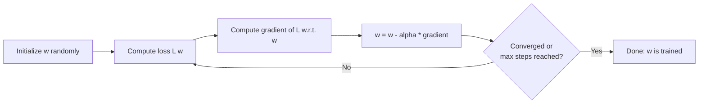

# 01 — Concepts: Gradient Descent

## The core idea

To minimize a loss function `L(w)` over parameters `w`, repeatedly move `w`
in the direction that decreases `L` fastest — the **negative gradient**:

```
w := w - α * ∇L(w)
```

`α` (the **learning rate**) controls the step size. Repeat until `L`
stops decreasing meaningfully (**convergence**) or you hit a step budget.



## Why negative gradient

The gradient points toward steepest *increase* (Lesson 014); to decrease the
loss, step in the exact opposite direction. Every "training" step you've
ever seen in any ML framework is this loop, however deep or fancy the model.

## Worked example: linear regression by gradient descent

Model: `ŷ = w*x + b`. Loss (mean squared error):

```
L(w, b) = (1/n) * Σ (ŷ_i - y_i)^2
```

Gradients (derived via the chain rule):

```
∂L/∂w = (2/n) * Σ (ŷ_i - y_i) * x_i
∂L/∂b = (2/n) * Σ (ŷ_i - y_i)
```

```python
import numpy as np

def train(x, y, lr=0.01, epochs=1000):
    w, b = 0.0, 0.0
    n = len(x)
    for _ in range(epochs):
        y_hat = w * x + b
        error = y_hat - y
        dw = (2 / n) * np.dot(error, x)
        db = (2 / n) * error.sum()
        w -= lr * dw
        b -= lr * db
    return w, b
```

## Learning rate tradeoffs

- **Too small**: converges, but painfully slowly — many wasted steps.
- **Too large**: can overshoot the minimum, oscillate, or even diverge
  (loss increases instead of decreasing).
- **Just right**: steady, efficient decrease. Finding it is often empirical —
  try a few values on a log scale (0.1, 0.01, 0.001) and watch the loss
  curve.

## Batch, Stochastic, and Mini-batch Gradient Descent

| Variant | Gradient computed from | Tradeoff |
|---|---|---|
| **Batch** | the entire dataset, every step | Accurate gradient, but slow per step; impossible for datasets too big for memory |
| **Stochastic (SGD)** | one random sample per step | Fast, noisy updates — the noise can actually help escape shallow local minima, but convergence is jittery |
| **Mini-batch** | a small random batch (e.g. 32–256 samples) | The practical default for almost all deep learning — balances gradient accuracy with speed, and matches GPU parallelism well |

Every "batch size" hyperparameter you'll set when training a neural network
(including an LLM) refers to mini-batch gradient descent.

## Convergence and local minima

For **convex** loss functions (like linear regression's MSE), gradient
descent is guaranteed to find the global minimum with a small-enough learning
rate. For **non-convex** losses (virtually all neural networks), it can get
stuck in local minima or saddle points — in practice, this matters less than
you'd expect for large networks (there's evidence most local minima in large
networks are nearly as good as the global one), but it's why training the
same network twice with different random initializations can give slightly
different results.

## Feature scaling matters

If features are on very different scales (Lesson 008's standardization),
the loss surface becomes a narrow, elongated valley — gradient descent
zig-zags slowly down it instead of heading directly to the minimum.
Standardizing features first (mean 0, std 1) makes the loss surface more
circular/well-conditioned and dramatically speeds up convergence.
