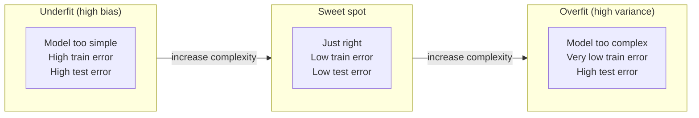

# 01 — Concepts: Bias-Variance Tradeoff

## The decomposition

A model's expected prediction error on new data can be decomposed into three
parts:

```
Error = Bias^2 + Variance + Irreducible noise
```

- **Bias**: error from wrong assumptions in the model (e.g. fitting a
  straight line to curved data). High bias → **underfitting** — the model is
  too simple to capture the real pattern, and does poorly on *both* training
  and test data.
- **Variance**: error from the model being too sensitive to the specific
  training data it saw. High variance → **overfitting** — the model
  memorizes noise/quirks in training data, does great on training data but
  poorly on new data.
- **Irreducible noise**: randomness inherent to the problem that no model
  can eliminate (measurement error, genuinely unpredictable factors).

## The tradeoff

Model complexity typically trades one for the other:

| | Simple model (e.g. linear) | Complex model (e.g. deep tree, high-degree polynomial) |
|---|---|---|
| Bias | High | Low |
| Variance | Low | High |
| Training error | Higher | Lower (can approach 0) |
| Test error | Higher (underfit) | Higher (overfit) unless regularized/enough data |

The goal is the **sweet spot** — enough complexity to capture the real
pattern, not so much that it captures noise too.



## Diagnosing which one you have

Compare training error to validation/test error:

- **Training error high, test error high, similar to each other** →
  underfitting (high bias). Fix: use a more expressive model, add features,
  reduce regularization, train longer.
- **Training error low, test error much higher** → overfitting (high
  variance). Fix: get more data, add regularization (Lesson 022), reduce
  model complexity, use dropout (Lesson 042), early stopping.
- **Both errors low and close together** → you're in a good spot.

## Learning curves

Plotting training and validation error against training-set size reveals
which regime you're in: if both curves plateau at a high error and converge
to each other → bias problem (more data won't help much, need a better
model). If there's a large, persistent gap between training and validation
error even as data grows → variance problem (more data, or regularization,
will likely help).

## Cross-validation as a variance-reduction tool for your *evaluation*

Any single train/test split has its own variance — you might get a lucky or
unlucky split. **K-fold cross-validation** (train on K-1 folds, validate on
the remaining fold, rotate, average) gives a more reliable error estimate
than one split, and reveals how variable your model's performance is across
different subsets of the data (a high spread across folds is itself a
variance signal).

## Regularization as an explicit bias-variance dial

Regularization (Lesson 022) deliberately adds bias to reduce variance: by
penalizing large weights, you constrain the model's flexibility, trading a
bit of fit on training data for a model that generalizes better —
essentially, moving deliberately along the bias-variance curve rather than
only controlling it via model architecture choice.
