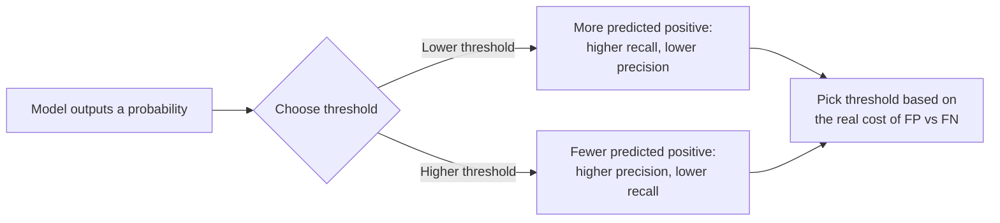

# 01 — Concepts: Evaluation Metrics

## Regression metrics

- **MAE** (Mean Absolute Error): `mean(|y_true - y_pred|)` — same units as
  the target, robust to outliers (doesn't square them).
- **MSE** (Mean Squared Error): `mean((y_true - y_pred)^2)` — penalizes large
  errors much more than small ones (an error of 10 contributes 100x more
  than an error of 1); the standard training loss for regression (Lesson
  015) because it's smooth and differentiable everywhere.
- **RMSE**: `sqrt(MSE)` — back in the target's original units, easier to
  interpret than MSE while keeping the "penalize large errors more" property.
- **R² (coefficient of determination)**: fraction of variance in the target
  explained by the model, `1 - (SS_residual / SS_total)`. `R²=1` is a perfect
  fit, `R²=0` means "no better than predicting the mean every time,"
  negative means *worse* than that baseline.

## Classification: the confusion matrix

The foundation everything else is built from:

|  | Predicted Positive | Predicted Negative |
|---|---|---|
| **Actually Positive** | True Positive (TP) | False Negative (FN) |
| **Actually Negative** | False Positive (FP) | True Negative (TN) |

- **Accuracy**: `(TP+TN) / total` — misleading on imbalanced data (Lesson
  006's disease-test example: a model that always predicts "healthy" gets
  99.9% accuracy on a rare disease while catching zero real cases).
- **Precision**: `TP / (TP+FP)` — "of everything I flagged positive, how
  much was actually positive?" High precision matters when false positives
  are costly (e.g. flagging legitimate transactions as fraud).
- **Recall (sensitivity)**: `TP / (TP+FN)` — "of everything actually
  positive, how much did I catch?" High recall matters when false negatives
  are costly (e.g. missing an actual disease case, missing actual spam/
  AI-generated text in a detector).
- **F1 score**: harmonic mean of precision and recall,
  `2 * (P*R) / (P+R)` — a single number balancing both, useful when you need
  one metric but care about both false positives and false negatives.

**Precision/recall tradeoff**: a classifier outputs a probability; where you
set the decision threshold (default 0.5) trades one for the other — lower
the threshold to catch more positives (higher recall, lower precision) or
raise it to be more selective (higher precision, lower recall).

## ROC curve and AUC

The **ROC curve** plots True Positive Rate (recall) against False Positive
Rate (`FP / (FP+TN)`) across every possible decision threshold. **AUC**
(Area Under the Curve) summarizes it in one number: 1.0 = perfect classifier,
0.5 = no better than random guessing, <0.5 = worse than random (predictions
are inverted). AUC is threshold-independent — useful for comparing models
before you've picked an operating threshold.

## Multi-class metrics

Precision/recall/F1 extend to multi-class via **averaging**:
- **Macro-average**: compute the metric per class, then average unweighted —
  treats every class equally regardless of size.
- **Weighted-average**: average weighted by each class's support (number of
  true instances) — reflects overall performance on the actual class
  distribution.
- **Micro-average**: pool all TP/FP/FN across classes first, then compute —
  equivalent to overall accuracy for single-label multi-class problems.

## Choosing the right metric: it's a business/problem decision, not a default

- Rare disease detector → prioritize **recall** (missing a real case is far
  worse than a false alarm that gets double-checked).
- Spam filter → prioritize **precision** (flagging a real email as spam is
  more annoying than letting one spam email through).
- Balanced classes, no asymmetric cost → **accuracy** or **F1** is fine.
- Comparing models before choosing a threshold → **AUC**.
- Regression with occasional huge outlier errors that matter a lot → **RMSE**
  (penalizes them); if outliers are noise you don't want to over-weight →
  **MAE**.

There is no universally "best" metric — the right one depends on what a
wrong prediction actually costs in your specific problem.
