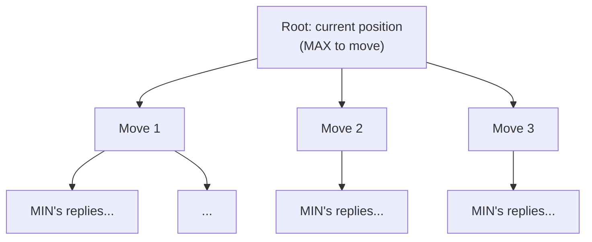
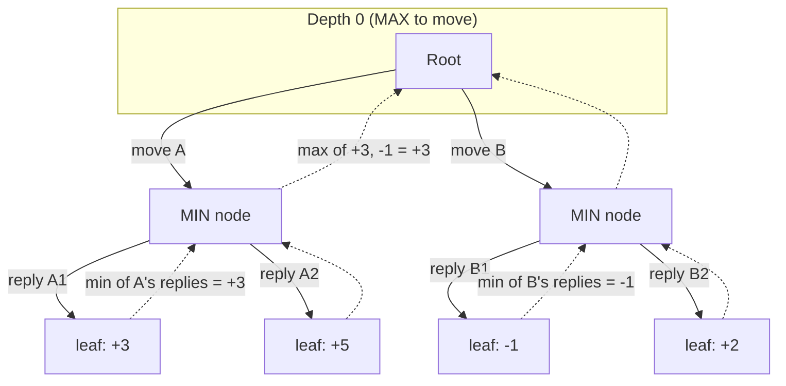

# 01 — Concepts: Game Trees & Minimax

## Framing a game as a tree

Every position in a two-player, turn-based, perfect-information game (tic-
tac-toe, chess, connect four) is a **node**; each legal move is an **edge**
to a child node (the resulting position). The **root** is the current
position; leaves are terminal positions (win/loss/draw).



This is the exact same tree/recursion structure as Lesson 002's recursive
data structures, applied to game states instead of lists — and the same
"visit every node" mental model as a tree traversal, just alternating whose
turn it is at each depth.

## MAX and MIN

Games are framed with one player as **MAX** (trying to maximize the
evaluation score — you, or "the engine to move") and the other as **MIN**
(trying to minimize it — the opponent). Both players are assumed to play
**optimally** — minimax doesn't model a weak or mistake-prone opponent, it
finds the best move assuming the worst-case (best-play) response.

## The minimax algorithm

Recursively: at a MAX node, pick the child with the **highest** value; at a
MIN node, pick the child with the **lowest** value; at a leaf, use a static
evaluation (Lesson 049).

```python
def minimax(position, depth, maximizing_player):
    if depth == 0 or position.is_terminal():
        return evaluate(position)

    if maximizing_player:
        best = float("-inf")
        for move in position.legal_moves():
            value = minimax(position.make_move(move), depth - 1, False)
            best = max(best, value)
        return best
    else:
        best = float("inf")
        for move in position.legal_moves():
            value = minimax(position.make_move(move), depth - 1, True)
            best = min(best, value)
        return best
```



MIN picks the worst-for-MAX outcome under each branch (`+3` under move A,
`-1` under move B); MAX then picks whichever branch has the **better**
worst-case — move A, guaranteeing at least `+3` regardless of how well MIN
plays. This "guarantee against a worst-case, optimally-playing opponent" is
exactly what minimax computes, and exactly why it's the correct algorithm
for adversarial, perfect-information games.

## Why you can't search to the end for chess (but can for tic-tac-toe)

Tic-tac-toe's entire game tree has under 300,000 leaf positions — trivial
to search completely. Chess has been estimated to have roughly `10^120`
possible games (the "Shannon number") — utterly infeasible to search fully
with any amount of realistic compute. The practical fix: search only a
limited **depth** (e.g. 4-6 moves ahead), then apply a **static evaluation
function** (Lesson 049) at the depth limit instead of a true win/loss/draw
value — trading exactness for feasibility.

## Zero-sum games and why one evaluation score works for both players

Chess and tic-tac-toe are **zero-sum**: one player's gain is exactly the
other's loss. This means a single evaluation score (positive = good for
MAX, negative = good for MIN) suffices — MIN minimizing the same score MAX
maximizes is mathematically equivalent to MIN maximizing *their own*
score, since the scores are exact negatives of each other
(`score_MIN = -score_MAX`). This is why implementations often use
**negamax** — a simplified minimax that flips the sign each recursive call
instead of maintaining a separate MIN branch:

```python
def negamax(position, depth, sign):
    if depth == 0 or position.is_terminal():
        return sign * evaluate(position)
    best = float("-inf")
    for move in position.legal_moves():
        value = -negamax(position.make_move(move), depth - 1, -sign)
        best = max(best, value)
    return best
```

`negamax` is mathematically identical to minimax for zero-sum games and is
what most real chess engines actually implement, since it avoids
duplicating the MAX/MIN branches.

## What's missing so far (set up for Lesson 049)

Plain minimax explores **every** node in the tree down to the depth limit —
for chess with ~35 legal moves per position on average, depth 4 already
means `35^4 ≈ 1.5 million` positions evaluated for a single move decision.
Lesson 049 introduces **alpha-beta pruning**, which safely skips large
parts of the tree without changing the final answer, and a real
**evaluation function** to replace the placeholder `evaluate()` used here.
