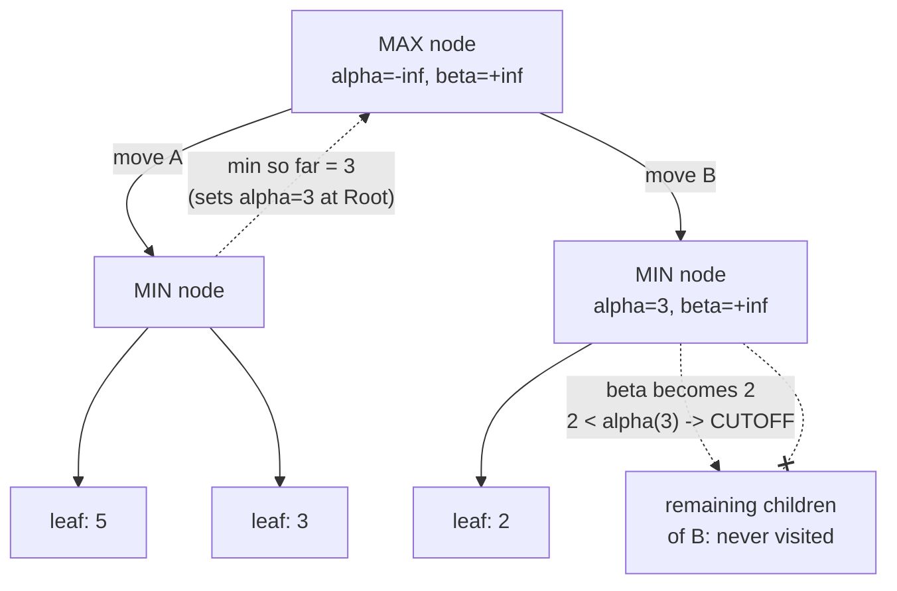

# 01 — Concepts: Alpha-Beta Pruning & Evaluation Functions

## The insight: some branches can never change the answer

Suppose MAX is evaluating move A and has already found a reply worth `+5`.
While evaluating move B, MIN's very first reply already brings B's value
down to `+2`. Since MIN will only ever make B's value go *lower* from here
(MIN minimizes), and MAX already has a guaranteed `+5` available via move A,
**MAX will never choose move B, no matter what its remaining branches
evaluate to.** There's no need to look at them at all — this is a pruned
branch.

## Alpha-beta pruning

Track two bounds while searching:
- **α (alpha)**: the best value MAX can already guarantee somewhere in the
  tree so far.
- **β (beta)**: the best value MIN can already guarantee somewhere in the
  tree so far.

Prune (stop exploring) whenever `α >= β` — the branch cannot produce a
result either player would actually choose, given what's already
available elsewhere.

```python
def alphabeta(position, depth, alpha, beta, maximizing):
    if depth == 0 or position.is_terminal():
        return evaluate(position)

    if maximizing:
        value = float("-inf")
        for move in position.legal_moves():
            value = max(value, alphabeta(position.make_move(move), depth-1, alpha, beta, False))
            alpha = max(alpha, value)
            if alpha >= beta:
                break   # beta cutoff: MIN already has a better option elsewhere
        return value
    else:
        value = float("inf")
        for move in position.legal_moves():
            value = min(value, alphabeta(position.make_move(move), depth-1, alpha, beta, True))
            beta = min(beta, value)
            if alpha >= beta:
                break   # alpha cutoff: MAX already has a better option elsewhere
        return value
```



**Critical property: alpha-beta pruning changes *zero* results.** It always
returns the exact same value (and the same best move) as plain minimax on
the same tree — it only skips work that provably cannot change the answer.
This is why Lesson 048's practicals could time the "before" and this
lesson's practicals time the "after," with the *chosen move* staying
identical both times.

## Move ordering matters — a lot

Alpha-beta's pruning power depends heavily on the **order** moves are
tried: if the best move is tried first, cutoffs happen early and often; if
tried last, little gets pruned. Real engines use heuristics to guess good
moves first (e.g. try captures before quiet moves, or previously-good moves
from a smaller search first) — this is why real chess engines are often
much faster in practice than the theoretical worst-case for alpha-beta
would suggest.

## Heuristic evaluation functions

At the search depth limit, `evaluate(position)` needs to estimate "how
good is this position" without searching further. For chess, a classic,
simple evaluation combines:

- **Material**: sum piece values (pawn=1, knight/bishop=3, rook=5, queen=9),
  positive for White's pieces, negative for Black's (or vice versa,
  matching your MAX/MIN convention).
- **Piece-square tables**: bonus/penalty for a piece type being on a
  specific square (e.g. knights are worth more centralized, pawns worth
  more advanced) — a lookup table added on top of raw material.
- **Mobility**: number of legal moves available (more options is generally
  better).
- **King safety**, **pawn structure**, and other refinements real engines
  add — Project 008 uses a simplified version (material + basic
  piece-square tables) as a strong-enough starting point.

```python
PIECE_VALUES = {"P": 1, "N": 3, "B": 3, "R": 5, "Q": 9, "K": 0}

def evaluate_material(board):
    score = 0
    for square in board.piece_map().values():
        value = PIECE_VALUES[square.symbol().upper()]
        score += value if square.color else -value
    return score
```

## Why this evaluation function *is* the "model" in Chess Bot v1

Project 008's entire "intelligence" is: alpha-beta search (this lesson) +
a hand-crafted evaluation function (this lesson) — **no machine learning
at all**. This is worth sitting with: a huge amount of chess-playing
strength comes purely from search efficiency and a reasonable evaluation
heuristic, with zero training data or gradient descent involved. Project
009 replaces the hand-crafted evaluation function with a trained neural
network (Lesson 044's CNN, applied to a board-as-image representation) —
the same search algorithm, a learned evaluation instead of a hand-written
one.

## Depth limits and quiescence (brief mention)

Cutting the search off at a fixed depth can produce a misleading
evaluation if the position is "unstable" right at the cutoff (e.g. a piece
is about to be captured next move, just past the depth limit) — real
engines extend search a bit further in such "noisy" positions
(**quiescence search**) before trusting the static evaluation. Project 008
uses a plain fixed-depth cutoff for simplicity; this is a known, documented
simplification, not an oversight.
