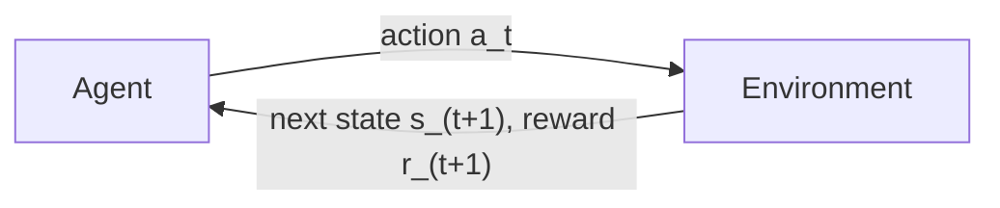

# 01 — Concepts: MDPs, Reward, Policy, Value

## What's different about reinforcement learning

Supervised learning (Modules 4, 6, 7): given `(x, y)` pairs, learn
`x -> y`. Reinforcement learning: an **agent** takes **actions** in an
**environment**, receiving **rewards**, with no labeled "correct action" at
each step — it must learn *what to do* purely from the consequences of its
own actions over time, including consequences that only show up much
later (a good chess move might not "pay off" for another 20 moves).



This loop — act, observe consequence, repeat — is fundamentally different
from anything in Modules 4-7, and is exactly the setting a chess-playing
agent lives in: "state" = board position, "action" = a legal move,
"reward" = win/loss/draw (only known at the very end of the game).

## Markov Decision Process (MDP) — the formal framework

An MDP is defined by:
- **States** `S`: every possible situation the agent can be in (a chess
  position).
- **Actions** `A`: what the agent can do from a given state (legal moves).
- **Transition function** `P(s'|s,a)`: probability of ending up in state
  `s'` after taking action `a` in state `s` (in chess, deterministic —
  a move leads to exactly one resulting position; many real-world RL
  problems are stochastic instead).
- **Reward function** `R(s,a,s')`: the reward received for that transition.
- **Discount factor** `γ` (gamma, `0 <= γ <= 1`): how much to value future
  reward vs immediate reward (see below).

**The Markov property**: the future depends only on the *current* state,
not on the history of how you got there. A chess position fully
determines what happens next (given a move) — the game doesn't "remember"
the sequence of moves that led there beyond what's encoded in the current
board (castling rights, en passant, etc. are part of the state precisely to
preserve this property).

## Reward and the discount factor

The agent's goal is to maximize **cumulative** (not just immediate) reward,
the **return**:

```
G_t = r_(t+1) + γ*r_(t+2) + γ^2*r_(t+3) + ...
```

`γ` close to 1 means the agent cares almost equally about distant future
rewards (patient); `γ` close to 0 means it mostly cares about immediate
reward (myopic). For a chess game where the only reward is
win(+1)/draw(0)/loss(-1) at the very end, `γ` close to 1 is essential —
otherwise a reward 40 moves away would be discounted to nearly nothing,
and the agent would have no learning signal for early-game moves at all.

## Policy: the agent's behavior

A **policy** `π(a|s)` is a (possibly probabilistic) mapping from states to
actions — "what the agent does." The **goal of RL** is to find the policy
that maximizes expected cumulative reward. This is directly analogous to
supervised learning's "find the weights that minimize loss" (Lesson 015),
just with a different objective (expected return, not a fixed labeled
loss) and no fixed dataset of correct actions to imitate.

## Value functions: how good is a state (or state-action pair)?

- **State-value function** `V(s)`: expected return starting from state `s`,
  following policy `π` thereafter.
- **Action-value function** `Q(s,a)`: expected return starting from state
  `s`, taking action `a`, then following `π` thereafter.

```
V(s) = E[G_t | s_t = s]
Q(s,a) = E[G_t | s_t = s, a_t = a]
```

`Q(s,a)` is what Lesson 051's Q-learning directly learns — once you know
`Q(s,a)` for every action in a state, the best action is simply
`argmax_a Q(s,a)`, no additional planning needed.

## The Bellman equation — recursion, again

Value functions satisfy a recursive relationship (directly analogous to
Lesson 002's recursive data structures and Lesson 048's recursive minimax):

```
V(s) = Σ_a π(a|s) * Σ_s' P(s'|s,a) * [R(s,a,s') + γ*V(s')]
```

In words: "the value of a state equals the immediate expected reward, plus
the discounted value of wherever you end up next." This recursive
structure is what makes value functions *computable* via iterative methods
(Lesson 051's value iteration) rather than needing to simulate every
possible infinite future directly.

## Exploration vs exploitation

The agent must balance **exploiting** what it currently believes is the
best action (to gain reward) against **exploring** other actions (which
might turn out to be even better, but aren't yet known to be). Always
exploiting risks getting stuck with a mediocre policy the agent never
learns to improve on; always exploring wastes reward on actions already
known to be worse. Lesson 051's ε-greedy strategy is the simplest concrete
way to balance this tradeoff, and every RL algorithm in this module deals
with it in some form.

## Connecting back to Chess Bot v1 (Project 008) and forward to v3 (Project 010)

Project 008's minimax bot has no learning at all — it re-derives the best
move from scratch via search, every single move, using a fixed hand-written
evaluation. An RL approach instead **learns** a value function or policy
from experience (games played), which can then guide search far more
efficiently than a hand-crafted heuristic — exactly what Project 010's
self-play + MCTS (Lessons 053-054) does, using a *trained* value function
in place of Project 008's `evaluate()`.
