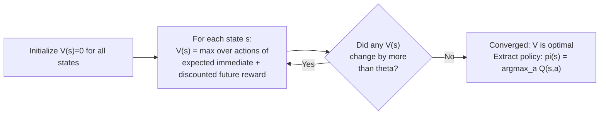

# 01 — Concepts: Q-Learning & Value Iteration

## Two settings: model-based vs model-free

- **Model-based** (you know `P(s'|s,a)` and `R(s,a,s')` exactly): use
  **value iteration** — directly apply the Bellman equation (Lesson 050)
  repeatedly until it converges.
- **Model-free** (you *don't* know the environment's dynamics upfront, only
  what happens when you actually try things): use **Q-learning** — learn
  purely from sampled experience (state, action, reward, next state)
  tuples, no model of the environment required.

Chess is technically model-based (the rules are fully known — you can
simulate any move), which is exactly why Project 008's minimax works at
all without any learning. Q-learning becomes essential in settings where
you *can't* enumerate every consequence in advance — or, as in Project
010, when learning a good move-selection **policy** directly from
experience is more practical than an exhaustive search.

## Value iteration

Repeatedly apply the Bellman **optimality** equation as an update rule
until values stop changing:

```
V(s) <- max_a Σ_s' P(s'|s,a) * [R(s,a,s') + γ*V(s')]
```

```python
def value_iteration(states, actions, P, R, gamma=0.9, theta=1e-6):
    V = {s: 0.0 for s in states}
    while True:
        delta = 0
        for s in states:
            v_old = V[s]
            V[s] = max(
                sum(P[s][a][s2] * (R[s][a][s2] + gamma * V[s2]) for s2 in states)
                for a in actions(s)
            )
            delta = max(delta, abs(v_old - V[s]))
        if delta < theta:
            break
    return V
```



This is **dynamic programming** (breaking a problem into overlapping
subproblems, Lesson 002-adjacent idea) applied to the Bellman equation —
guaranteed to converge to the true optimal value function for a
known, finite MDP.

## Q-learning: learning Q(s,a) from experience, no model needed

```
Q(s,a) <- Q(s,a) + α * [r + γ*max_a' Q(s',a') - Q(s,a)]
```

Read the bracketed term as a **prediction error** (a direct callback to
supervised learning's residual, Lesson 020): `r + γ*max_a' Q(s',a')` is a
better estimate of `Q(s,a)`'s true value (using the *actual* observed
reward `r` plus the best next state's current estimate) than `Q(s,a)`'s
current value — so nudge `Q(s,a)` toward that better estimate, scaled by
learning rate `α` (Lesson 015's gradient descent update, same shape).

```python
import random
from collections import defaultdict

def q_learning(env, n_episodes=1000, alpha=0.1, gamma=0.95, epsilon=0.1):
    Q = defaultdict(lambda: defaultdict(float))
    for _ in range(n_episodes):
        state = env.reset()
        done = False
        while not done:
            if random.random() < epsilon:
                action = env.random_action(state)          # explore
            else:
                action = max(Q[state], key=Q[state].get, default=env.random_action(state))  # exploit

            next_state, reward, done = env.step(state, action)
            best_next = max(Q[next_state].values(), default=0.0)
            Q[state][action] += alpha * (reward + gamma * best_next - Q[state][action])
            state = next_state
    return Q
```

## ε-greedy: the concrete exploration/exploitation answer

With probability `ε`, take a **random** action (explore); otherwise take
the currently-best-known action (exploit). Common practice: start with
high `ε` (mostly explore, since `Q` estimates are unreliable early on) and
decay it over training (shift toward exploiting as estimates improve) —
directly analogous to Lesson 041's learning rate schedules, applied to the
exploration rate instead.

## Why Q-learning is called "off-policy"

Q-learning's update uses `max_a' Q(s',a')` — the *best possible* next
action — regardless of what action the ε-greedy policy actually took next
(which might have been a random exploratory action). This means Q-learning
learns about the **optimal** policy while *behaving* according to a
different (exploratory) policy — the "off-policy" property. Contrast with
**on-policy** methods (like SARSA, briefly worth knowing exists), which
update using the action the policy *actually* takes next, learning about
the policy actually being followed, exploration noise included.

## Tabular Q-learning's fatal limitation — and the bridge to Lesson 052

The `Q` table above has one entry per `(state, action)` pair. For tic-tac-
toe (thousands of states) this is barely feasible; for chess
(more board positions than atoms in the observable universe, an
often-cited estimate) a table is completely impossible — you can never
visit, let alone store, more than a vanishing fraction of possible
positions. This is precisely why Project 010 doesn't use tabular Q-learning
directly: it needs a **function approximator** (a neural network) to
generalize from the positions it *has* seen to the vastly larger number it
hasn't — Lesson 052's policy gradient methods, and ultimately Lesson 054's
self-play setup, are built around exactly this neural-network-based
generalization.
