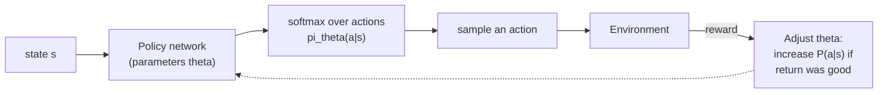

# 01 — Concepts: Policy Gradients & Actor-Critic

## Learning a policy directly, instead of deriving one from values

Represent the policy as a parameterized function `π_θ(a|s)` — a
probability distribution over actions, produced by (in this curriculum's
context) a neural network with parameters `θ` and a **softmax** output
(Lesson 036), exactly like a classifier's output layer, except the
"classes" are actions and the network's job is choosing well, not matching
a fixed label.



## The REINFORCE gradient

The goal is to maximize expected return `J(θ) = E[G_t]`. The **policy
gradient theorem** gives a way to estimate `∇J(θ)` from sampled episodes,
without needing to know the environment's dynamics at all:

```
∇J(θ) ≈ Σ_t ∇log(π_θ(a_t|s_t)) * G_t
```

Update rule (gradient **ascent**, since we're maximizing reward — the sign
flip from Lesson 015's gradient *descent* on a loss):

```
θ <- θ + α * ∇log(π_θ(a_t|s_t)) * G_t
```

**Intuition**: `∇log(π_θ(a_t|s_t))` points in the direction that would
increase the probability of the action actually taken. Scaling it by `G_t`
(the actual return that followed) means: if the episode turned out well
(`G_t` large/positive), push the policy to make that action *more* likely
next time; if it turned out badly, push it to make that action *less*
likely. This is trial-and-error learning, formalized as a gradient — good
outcomes get reinforced (hence the algorithm's name), bad outcomes get
suppressed, both in exact proportion to how good/bad the outcome was.

## Why this is "log probability," specifically

`∇log(π)` rather than `∇π` directly comes from the derivation (using the
identity `∇π = π * ∇log(π)`, sometimes called the "log-derivative trick")
and has a practical benefit: it naturally normalizes the gradient's scale
by how *confident* the policy already was — nudging a near-certain action's
probability further is naturally down-weighted relative to nudging an
uncertain one, which turns out to produce better-behaved updates in
practice. You'll recognize this exact `-log(p)` shape from Lesson 016's
cross-entropy loss — policy gradient's update is, not coincidentally,
extremely close in form to a classification loss weighted by `G_t`.

## High variance — the practical problem with plain REINFORCE

`G_t` (a full episode's return) is noisy — the same action can be followed
by wildly different total rewards just from randomness elsewhere in the
episode. This makes plain REINFORCE's gradient estimates high-variance and
slow/unstable to train with. The standard fix: subtract a **baseline**
`b(s)` (commonly an estimate of `V(s)`) from `G_t`:

```
θ <- θ + α * ∇log(π_θ(a_t|s_t)) * (G_t - b(s_t))
```

Subtracting a baseline doesn't change the *expected* gradient (a
mathematical fact worth taking on faith here) but substantially reduces its
variance — "was this action better or worse than *expected* from this
state," rather than "was the raw return positive or negative," is a much
less noisy training signal.

## Actor-Critic: learning the baseline too

**Actor-Critic** methods learn *two* things simultaneously:
- **Actor**: the policy `π_θ(a|s)` (as above) — decides what to do.
- **Critic**: a value function `V_φ(s)` (a separate small network, trained
  with ordinary supervised regression toward observed returns, Lesson 020's
  MSE loss) — estimates how good a state is, providing the baseline.

```
advantage A(s,a) = G_t - V_φ(s_t)      # "how much better than expected was this?"
actor update:  θ <- θ + α * ∇log(π_θ(a_t|s_t)) * A(s,a)
critic update: φ <- φ - α * ∇[(V_φ(s_t) - G_t)^2]     # ordinary regression, Lesson 015
```

The critic reduces variance in the actor's updates (as above); the actor
provides the critic with the states/actions worth evaluating. This
two-network, mutually-improving setup is the direct conceptual ancestor of
Lesson 054's self-play training, which trains a **combined** policy+value
network (one network, two output heads) via self-play games instead of a
single-agent environment.

## Where this leaves you for Lesson 053-054

Policy gradients let an agent learn *directly* what to do from experience,
with a neural network that generalizes across similar states — solving
tabular Q-learning's scaling problem from Lesson 051. Lesson 053's MCTS
combines this kind of learned policy/value estimate with *search*
(revisiting Lesson 048's game trees, but guided by learned estimates
instead of a hand-crafted evaluation) — the exact combination AlphaZero-
style engines use, and what Project 010 implements.
