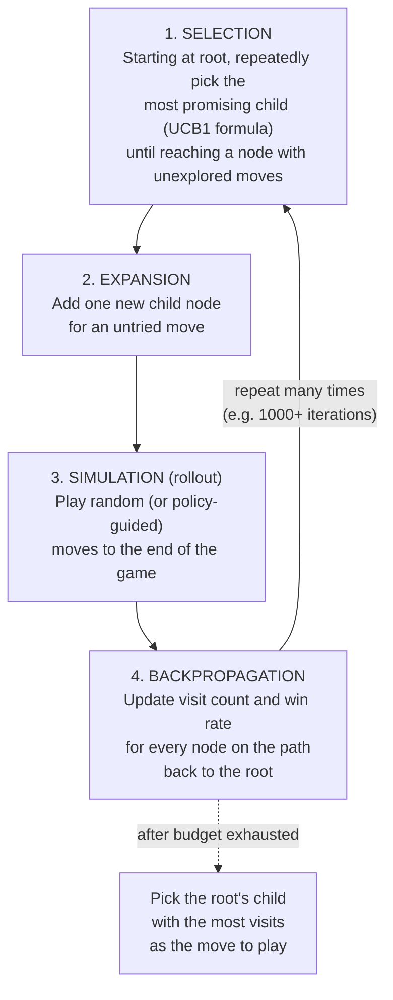

# 01 — Concepts: Monte Carlo Tree Search

## Why not just minimax with alpha-beta everywhere?

Lessons 048-049's alpha-beta search is powerful but needs a **hand-crafted
evaluation function** at the depth cutoff, and explores the tree fairly
uniformly (aside from move ordering). MCTS takes a different approach:
build the search tree **asymmetrically**, spending most of the search
budget on the most promising lines, and evaluate positions via **random
simulation** (or, in AlphaZero-style engines, a learned value network,
Lesson 054) rather than a hand-written formula.

## The four phases, repeated many times per move decision



## Selection: the UCB1 formula (balancing exploration/exploitation, again)

At each node during selection, pick the child maximizing:

```
UCB1(node) = (wins(node) / visits(node)) + C * sqrt(ln(visits(parent)) / visits(node))
```

- First term: **exploitation** — how good this move has looked so far.
- Second term: **exploration bonus** — larger for less-visited nodes
  (`visits(node)` in the denominator), shrinking as a node gets visited
  more. `C` controls the exploration/exploitation tradeoff (Lesson 051's
  ε-greedy solves the same underlying problem a different way).

This is the *exact same* exploration/exploitation tension from Lesson 050,
solved with a different formula suited to tree search rather than a single
repeated choice.

## Simulation (rollout): a cheap, noisy value estimate

From the newly expanded node, play out the rest of the game using a fast
(often uniformly random, or a cheap heuristic) policy, and record the
result (win/loss/draw). This single rollout is a very **noisy** estimate of
the position's true value — but averaged over hundreds or thousands of
rollouts (weighted toward promising lines by the selection phase), the
noise cancels out (the Law of Large Numbers, Lesson 007) and the estimate
becomes reliable enough to guide move choice.

## Why more simulations concentrate on better moves automatically

Because selection always follows UCB1's "best so far, with an exploration
bonus" logic, moves that turn out well accumulate more visits (they keep
getting selected), which means they get more precise value estimates
(more rollouts averaged), which reinforces choosing them again — a
self-reinforcing process that naturally allocates most of the search
budget to the most promising few moves rather than spreading effort evenly
across all legal moves the way plain minimax does.

## MCTS vs alpha-beta: complementary, not strictly better

| | Alpha-beta (Lessons 048-049) | MCTS |
|---|---|---|
| Needs a hand-crafted evaluation | Yes, at the depth cutoff | No — inherently, via rollouts (or a learned value net) |
| Search shape | Roughly uniform to a fixed depth | Highly asymmetric, deeper on promising lines |
| Works well when... | Good evaluation function exists, branching factor moderate | Evaluation is hard to hand-craft, or a learned value/policy net is available |
| Classic strength | Traditional chess engines (Stockfish's earlier generations) | Go (where hand-crafted evaluation historically failed badly), AlphaZero-style engines |

Modern top engines (recent Stockfish versions) actually combine ideas from
both worlds (alpha-beta search with a neural network evaluation) — the
"pure MCTS vs pure alpha-beta" framing is somewhat a simplification, useful
for learning the concepts distinctly before you see them blended in
practice.

## Setting up Lesson 054 and Project 010

Plain MCTS (this lesson) uses **random rollouts** to estimate value — noisy
but requires no training at all. AlphaZero's key innovation, covered in
Lesson 054, replaces the random rollout with a **trained neural network**
that directly predicts both a value (who's winning) and a policy (which
moves look promising) — making each simulation far more informative than a
purely random rollout, and letting the *network itself* improve over
successive rounds of self-play. Project 010 implements exactly this
combination.
