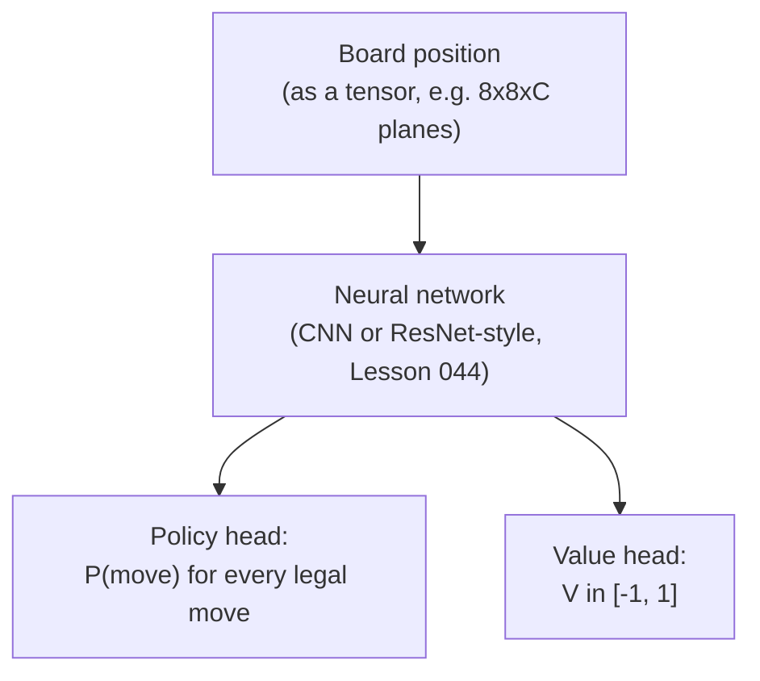
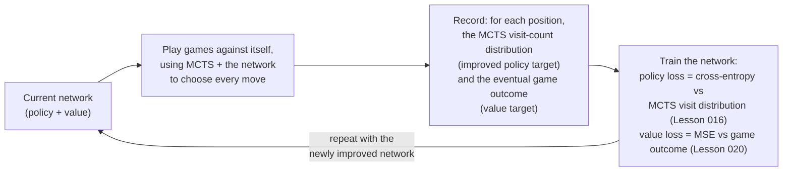

# 01 — Concepts: Self-Play & AlphaZero-Style Training

## The key idea: replace both hand-crafted pieces with one learned network

Project 008's bot needs a **hand-crafted evaluation function**
(Lesson 049). Plain MCTS (Lesson 053) needs **random rollouts** to
estimate value, which is noisy and wastes computation on clearly-bad lines.
AlphaZero's insight: train a single neural network with **two outputs**
that replaces both:

```
neural_network(board) -> (policy p, value v)

p: a probability distribution over legal moves ("which moves look promising")
v: a single number in [-1, 1] ("who's winning, and by how much")
```



The network architecture is exactly Lesson 044's CNN/ResNet ideas: convolutional
layers process the board (Lesson 043's spatial-pattern reasoning applies
directly — a chess board is a small "image" with piece-type channels), with
two separate output heads instead of one classification head.

## MCTS guided by the network, instead of random rollouts

Lesson 053's MCTS used **random rollouts** to estimate a node's value.
AlphaZero-style MCTS instead:
- Uses the policy output `p` to bias **selection** (UCB1 becomes
  "PUCT," weighting exploration by the network's own move
  probabilities — moves the network already thinks are promising get
  explored more readily).
- Uses the value output `v` **directly as the node's value estimate**,
  skipping the random rollout to a terminal state entirely — a single
  forward pass through the network replaces an entire noisy simulated
  game.

This makes each simulation far more informative (guided by learned
pattern-recognition instead of random play) and dramatically cheaper per
simulation (one network forward pass vs. playing out an entire game).

## The self-play training loop



The crucial trick: **MCTS search (guided by the current network) produces a
*better* move distribution than the raw network policy alone** (search
finds tactics the network's single forward pass might miss). Training the
network to match MCTS's *improved* distribution (rather than just its own
prior output) is what makes the network **better than itself** each
iteration — this self-improvement loop, repeated many times, is the entire
mechanism behind AlphaZero reaching superhuman strength with zero human
game data as a starting point.

## The combined loss function

```
Loss = (v - z)^2 - π^T log(p) + c * ||θ||^2
```

- `(v - z)^2`: value loss — MSE (Lesson 020) between the network's value
  prediction `v` and the actual game outcome `z` (+1/-1/0) for that
  position.
- `-π^T log(p)`: policy loss — cross-entropy (Lesson 016) between the
  network's raw policy `p` and `π`, the **improved** policy from MCTS's
  visit counts (normalized to sum to 1) at that position.
- `c * ||θ||^2`: L2 weight regularization (Lesson 022), same purpose as
  everywhere else it's appeared.

Both the policy and value heads train **simultaneously**, from the same
self-play data, with a single combined loss — an efficient design that
lets shared early layers (which learn general board-pattern features)
benefit both heads at once.

## Why no human data is needed at all

The network starts with random weights (random policy, random value
estimates). Its very first self-play games are close to random play, but
even random play generates real, unambiguous win/loss/draw outcomes — a
genuine training signal. Each training iteration makes the network
slightly better, which makes its guided-MCTS self-play games slightly
better, which produces slightly better training data — a virtuous cycle
requiring nothing but the game's rules and enough compute, no games played
by human experts anywhere in the loop.

## Realistic expectations for Project 010

AlphaZero's original chess training used **thousands of TPUs** for hours to
reach superhuman play. Project 010's self-play Chess Bot v3 will use the
exact same *algorithm*, at a scale that fits a personal computer — enough
to demonstrate genuine self-improvement over training iterations and
noticeably outperform a random or very-shallow-search baseline, but not
enough to rival Project 008/009's more mature, deeply-searched engines
within a reasonable training budget. The point is understanding and
implementing the *mechanism*, not reproducing DeepMind's compute budget —
worth setting this expectation explicitly before starting Project 010.

## The full arc, looking back across Module 8

| Lesson | Contribution to Project 010 |
|---|---|
| 048 — Minimax | The tree-search mental model everything else builds on |
| 049 — Alpha-beta + evaluation | Search pruning ideas; hand-crafted eval as v1's baseline |
| 050 — MDPs | The formal framing: chess as states/actions/rewards |
| 051 — Q-learning | Why tabular methods can't scale to chess; motivates function approximation |
| 052 — Policy gradients | How a network learns a policy from experience |
| 053 — MCTS | The search algorithm AlphaZero-style engines actually use |
| 054 — Self-play (this lesson) | How to train the network with zero human data, combining everything above |
