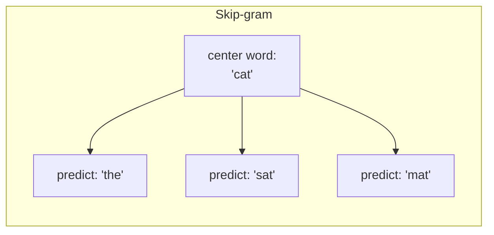

# 01 — Concepts: Word Embeddings

## The distributional hypothesis

"You shall know a word by the company it keeps" (Firth, 1957). Words that
appear in similar **contexts** tend to have similar meanings — "cat" and
"dog" both frequently appear near words like "pet," "feed," "vet," "cute,"
while "cat" and "astronaut" almost never share context. Word embeddings
learn vector representations **purely from co-occurrence patterns in raw
text**, with no explicit dictionary or hand-labeled meaning — directly
fixing Lesson 056's finding that TF-IDF has zero notion of word
relatedness.

## What an embedding actually is

A lookup table: each word/token ID maps to a dense vector of a few hundred
numbers (unlike TF-IDF's vocabulary-sized *sparse* vectors, Lesson 056).
This is exactly `nn.Embedding` from Lesson 039/040 — a trainable weight
matrix of shape `(vocab_size, embedding_dim)`, indexed by token ID.

```python
import torch.nn as nn
embedding = nn.Embedding(num_embeddings=10000, embedding_dim=100)
vectors = embedding(token_ids)   # (batch, seq_len) -> (batch, seq_len, 100)
```

## Word2Vec: learning embeddings via a fake prediction task

Word2Vec (Mikolov et al., 2013) trains embeddings by setting up a
supervised-looking task purely from raw text co-occurrence, with no human
labels:

- **Skip-gram**: given a word, predict its surrounding context words.
- **CBOW** (Continuous Bag of Words): given the surrounding context words,
  predict the missing middle word.



The actual **goal isn't the prediction task itself** — it's a pretext task
that forces the network to compress each word into a vector useful for
predicting its neighbors, and *that vector* (the trained embedding weight
row) is the real product. This "train on an easy-to-generate task purely
to get useful internal representations" pattern reappears directly in
Lesson 063's language modeling objective.

## Why this produces meaningful geometry

Words that appear in similar contexts get pushed toward similar embedding
vectors (their vectors need to predict similar neighboring words). The
famous emergent result: **vector arithmetic captures relationships**:

```
vector("king") - vector("man") + vector("woman") ≈ vector("queen")
```

This isn't hand-designed — it falls out purely from the training objective
and the geometry it induces. It's also become a somewhat over-cited,
partially-fragile demo (it works cleanly on some word pairs and less
cleanly on others) — worth appreciating as a genuine, remarkable emergent
property while not treating it as perfectly reliable.

## GloVe: a different training approach, similar result

**GloVe** (Global Vectors, Pennington et al., 2014) takes a more directly
statistical approach: build a global word-word co-occurrence matrix across
the entire corpus, then factorize it (conceptually related to Lesson 012's
SVD/low-rank approximation) to produce dense vectors whose dot products
approximate co-occurrence statistics. Word2Vec and GloVe often produce
embeddings of similar quality for similar tasks — different training
mechanisms converging on a similar kind of useful geometric representation.

## Pretrained embeddings vs training your own

Just like Lesson 044's pretrained CNN transfer learning, you can download
embeddings pretrained on huge corpora (Google News Word2Vec, GloVe trained
on Common Crawl) and use them directly, instead of training from scratch
on your own smaller corpus:

```python
import gensim.downloader as api
model = api.load("glove-wiki-gigaword-100")
model.most_similar("king")
model.similarity("cat", "dog")
```

## The critical limitation: one vector per word, regardless of context

Word2Vec/GloVe give **"bank" the exact same vector** whether it means a
riverbank or a financial institution — the embedding is *static*, learned
once, independent of the sentence it appears in. This is the single
biggest limitation motivating everything from Module 10 onward: **attention
(Lesson 058)** produces *contextual* embeddings — the vector representing
"bank" is computed fresh for every sentence, incorporating the surrounding
words, so "bank" in "river bank" and "bank" in "savings bank" get
genuinely different representations. Static embeddings were the state of
the art until roughly 2017-2018; contextual embeddings (via attention) are
what every modern LLM uses instead.

## Where embeddings live inside a Transformer/LLM

Every Transformer (Lesson 060) starts with an embedding layer identical in
spirit to this lesson's `nn.Embedding` — converting token IDs into dense
vectors — before attention layers make those vectors *contextual*. The
embedding table itself is typically trained end-to-end as part of the full
model (Module 11) rather than pretrained separately via Word2Vec/GloVe, but
the underlying idea — dense vectors that place related concepts near each
other in vector space — is unchanged from this lesson.
