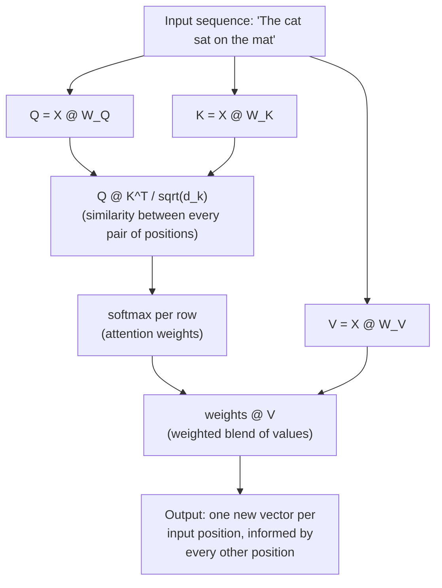

# 01 — Concepts: The Attention Mechanism

## The problem, precisely (recalling Lesson 047)

Seq2Seq's decoder had to make do with a single fixed-size context vector
summarizing the *entire* input sequence. Attention's fix: **let the
decoder look back at every encoder hidden state, at every decoding step,
weighted by relevance to what it's currently trying to produce** — instead
of forcing everything through one bottleneck vector.

## Query, Key, Value — the core abstraction

Every attention computation involves three vectors per position:
- **Query (Q)**: "what am I looking for right now?"
- **Key (K)**: "what do I contain, for matching purposes?"
- **Value (V)**: "what do I actually offer, if you decide I'm relevant?"

An analogy: searching a video platform. Your search text is the **query**;
each video's title/tags are its **key** (what gets matched against); the
video's actual content is its **value** (what you get once a match is
found). Attention does this same match-then-retrieve operation, but
*soft* — instead of returning one best match, it returns a **weighted
blend of every value**, weighted by how well each key matched the query.

## Scaled dot-product attention — the actual formula

```
Attention(Q, K, V) = softmax(Q @ K^T / sqrt(d_k)) @ V
```

Step by step:
1. `Q @ K^T`: dot product (Lesson 010) between every query and every key —
   a similarity score matrix. High dot product = well-aligned vectors =
   "this key matches this query well."
2. `/ sqrt(d_k)`: scale down by the square root of the key dimension.
   Without this, dot products grow large in magnitude as dimension grows,
   pushing softmax (Lesson 036) into a regime where its gradient is nearly
   zero (saturated) — this single division is what makes the whole thing
   trainable at realistic dimensions.
3. `softmax(...)`: turn similarity scores into a probability distribution
   (Lesson 036/007) — how much attention to pay to each position.
4. `@ V`: weighted sum of value vectors, using the attention distribution
   as weights — the actual output: a blend of values, weighted by
   relevance.

```python
import torch
import torch.nn.functional as F

def scaled_dot_product_attention(Q, K, V):
    d_k = Q.shape[-1]
    scores = Q @ K.transpose(-2, -1) / (d_k ** 0.5)
    weights = F.softmax(scores, dim=-1)
    return weights @ V, weights
```

## Self-attention: Q, K, V all come from the same sequence

The version used inside Transformers (Lesson 060): instead of a decoder
attending to a separate encoder's states (as in the original
Bahdanau/Seq2Seq attention), **every position in a sequence attends to
every other position in the *same* sequence** — Q, K, V are all linear
projections of the same input. This is what lets a Transformer directly
relate any two words in a sentence, however far apart, in a single step —
no sequential chain of RNN timesteps (Lesson 045) required at all.



## Why attention fixes the long-range dependency problem directly

RNNs (Lesson 045) need `n` sequential steps for information to flow from
position 1 to position `n`, with vanishing gradients degrading that signal
along the way (Lesson 046 needed gating to partially fix this). Attention
computes a direct connection between *any two positions in a single
matrix multiplication* — position 1 and position 1000 are exactly as easy
to relate as position 1 and position 2, since `Q @ K^T` computes all
pairwise similarities at once, with no sequential chain in between at all.

## Attention weights are interpretable

Unlike most of a neural network's internals, the attention weight matrix
(`softmax(Q@K^T/sqrt(d_k))`) can be directly visualized — for a given
query position, which other positions did it attend to most strongly?
This gives genuine (if partial and sometimes over-interpreted) insight into
what the model is "looking at" when producing an output, and is a common
way to sanity-check or debug a trained attention-based model.

## From here to Transformers

This lesson covers **one attention computation**. Lesson 059 runs many of
these in parallel (**multi-head attention**) so the model can attend to
different kinds of relationships simultaneously (e.g. one head tracking
grammatical structure, another tracking topical relevance). Lesson 060
assembles multi-head attention, feedforward layers, and residual
connections (Lesson 044's ResNet idea, reused directly) into the full
**Transformer block** — the architecture behind every model from here to
the end of this curriculum.
