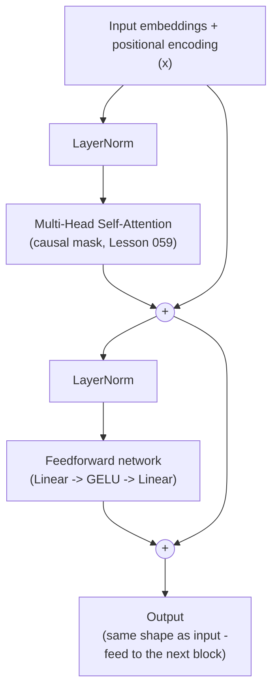

# 01 — Concepts: The Transformer Architecture

## Encoder-decoder vs decoder-only

The original "Attention is All You Need" Transformer had two stacks: an
**encoder** (processes the full input, bidirectional attention — used for
translation's source sentence) and a **decoder** (generates output
autoregressively, causal attention, Lesson 059 — also attends back to the
encoder's output). BERT uses only the encoder stack (good for
understanding/classification tasks). **GPT-style models — and everything
in Module 11 — use only the decoder stack**, with no separate encoder: the
model just predicts the next token, attending causally to everything
before it. This lesson focuses on the decoder-only block, since that's
what you'll actually build.

## The full Transformer (decoder) block



Two sub-layers per block: **multi-head self-attention**, then a
**position-wise feedforward network** — each wrapped in a residual
connection (Lesson 044's ResNet idea, reused verbatim) and preceded by
layer normalization (below). A full Transformer stacks many of these
identical blocks (GPT-2 small: 12 blocks; GPT-3: 96 — Project 013 will use
far fewer, sized for your own compute budget).

```python
import torch
import torch.nn as nn

class FeedForward(nn.Module):
    def __init__(self, d_model, d_ff):
        super().__init__()
        self.net = nn.Sequential(
            nn.Linear(d_model, d_ff),
            nn.GELU(),
            nn.Linear(d_ff, d_model),
        )
    def forward(self, x):
        return self.net(x)

class TransformerBlock(nn.Module):
    def __init__(self, d_model, n_heads, d_ff, dropout=0.1):
        super().__init__()
        self.ln1 = nn.LayerNorm(d_model)
        self.attn = MultiHeadAttention(d_model, n_heads)   # from Lesson 059
        self.ln2 = nn.LayerNorm(d_model)
        self.ff = FeedForward(d_model, d_ff)
        self.dropout = nn.Dropout(dropout)

    def forward(self, x, mask=None):
        x = x + self.dropout(self.attn(self.ln1(x), mask=mask))   # residual + attention
        x = x + self.dropout(self.ff(self.ln2(x)))                 # residual + feedforward
        return x
```

## Why residual connections here too (revisiting Lesson 044)

Exactly the same argument as ResNet: with `output = x + Sublayer(x)`, if a
block's ideal contribution is close to zero for some input, it just needs
to learn small weights rather than reconstruct the identity — and gradients
have an unimpeded path backward through the `+x` term, letting Transformers
stack dozens of blocks deep without the degradation problem Lesson 044
described for plain deep CNNs.

## Pre-LN vs Post-LN

The diagram above applies LayerNorm **before** each sub-layer ("Pre-LN") —
`x + Sublayer(LayerNorm(x))`. The original paper applied it **after**
("Post-LN") — `LayerNorm(x + Sublayer(x))`. Pre-LN (used above, and by
GPT-2 onward) trains more stably at depth, particularly without a careful
learning-rate warmup schedule — a real architectural lesson learned after
the original paper, worth knowing since you'll see both conventions in
different codebases.

## LayerNorm vs BatchNorm (a callback to Lesson 042)

BatchNorm normalizes across the **batch** dimension for each feature —
awkward for variable-length sequences (padding, Lesson 055, would skew the
batch statistics) and for very small or batch-size-1 inference. **LayerNorm**
instead normalizes across the **feature** dimension, independently for
each individual sequence position — no dependency on other examples in the
batch at all, which is why every Transformer uses LayerNorm, not BatchNorm.

```
LayerNorm(x) = γ * (x - mean(x)) / sqrt(var(x) + ε) + β    # mean/var computed over the feature dimension, per position
```

## Positional encoding: attention has no inherent sense of order

Unlike an RNN (which processes tokens in order, Lesson 045) or a CNN
(whose convolutions are inherently local/ordered, Lesson 043), attention's
`Q @ K^T` treats the input as an **unordered set** of positions — shuffle
the input tokens, and (without positional information) attention would
produce the same set of outputs, just reordered. **Positional encoding**
adds information about each token's position directly into its embedding
before attention ever runs.

- **Sinusoidal** (original paper): a fixed (non-learned) pattern of sine/
  cosine waves at different frequencies per dimension — deterministic, and
  extrapolates naturally to sequence lengths longer than seen in training.
- **Learned positional embeddings**: a trainable lookup table, one vector
  per position, added to token embeddings — simpler, used by GPT-2, but
  doesn't extrapolate past the maximum trained length.
- **RoPE (Rotary Position Embedding)**: used by most modern LLMs (Lesson
  061 covers this in depth) — encodes position by rotating query/key
  vectors, with some nice mathematical properties for relative position
  and length extrapolation.

## Full model assembly (what Project 013 builds)

```python
class GPT(nn.Module):
    def __init__(self, vocab_size, d_model, n_heads, n_layers, d_ff, max_len):
        super().__init__()
        self.token_embed = nn.Embedding(vocab_size, d_model)
        self.pos_embed = nn.Embedding(max_len, d_model)
        self.blocks = nn.ModuleList([TransformerBlock(d_model, n_heads, d_ff) for _ in range(n_layers)])
        self.ln_final = nn.LayerNorm(d_model)
        self.head = nn.Linear(d_model, vocab_size)

    def forward(self, idx):
        B, T = idx.shape
        positions = torch.arange(T, device=idx.device)
        x = self.token_embed(idx) + self.pos_embed(positions)
        causal_mask = torch.tril(torch.ones(T, T, device=idx.device))
        for block in self.blocks:
            x = block(x, mask=causal_mask)
        x = self.ln_final(x)
        return self.head(x)   # (B, T, vocab_size) logits - fed to cross-entropy (Lesson 063)
```

This **is** a GPT, architecturally — token embedding (Lesson 057) +
learned positional embedding + `n_layers` Transformer blocks (this lesson)
+ final projection to vocabulary logits (softmax over the vocabulary,
Lesson 036). Lesson 063 covers the training objective; Lessons 064-066
build this up incrementally with full explanations of every piece.
