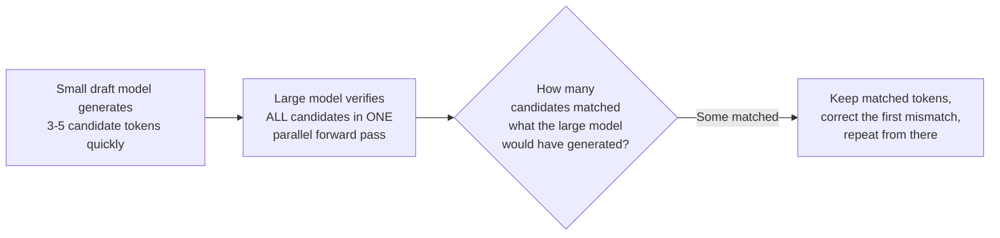

# 01 — Concepts: Inference Optimization

## The problem Lesson 066 left open: redundant computation

Lesson 066's naive `generate` loop recomputes attention over the **entire**
growing sequence at every single new token — at step `t`, it redoes all
the work already done at steps `1` through `t-1`. For a long generation,
this makes each successive token more expensive than the last, and wastes
enormous computation on keys/values that haven't changed at all since
they were first computed.

## KV-caching: compute once, reuse forever

Since causal attention (Lesson 059) means position `t`'s keys and values
never depend on anything *after* position `t`, they can be **computed once
and cached**, reused unchanged for every subsequent generation step:

```python
class CachedAttention(nn.Module):
    def forward(self, x, cache=None):
        Q, K, V = self.W_q(x), self.W_k(x), self.W_v(x)
        if cache is not None:
            K = torch.cat([cache["K"], K], dim=1)   # append new key to cached keys
            V = torch.cat([cache["V"], V], dim=1)
        new_cache = {"K": K, "V": V}
        # attention now only needs to compute Q (just the new token) against
        # the full K, V (cached + new) - not recomputing K, V for old positions
        ...
        return output, new_cache
```

With caching, generating each new token only requires a forward pass on
the **single new token** (not the whole sequence so far), with cached
keys/values providing the historical context "for free" — turning
per-token generation cost from growing with sequence length to
(approximately) constant, a dramatic practical speedup for anything beyond
very short generations.

**The memory tradeoff**: the cache itself grows with sequence length
(storing every position's K and V) — trading recomputation time for
memory, the same fundamental tradeoff as Lesson 067's gradient
checkpointing, in the opposite direction (there, trading compute *for*
memory savings; here, trading memory *for* compute savings).

## Quantization: reducing weight precision for inference

Lesson 067 covered mixed precision for *training*. For **inference-only**
use, you can go even lower: 8-bit or 4-bit integer quantization of model
weights, with a much smaller accuracy cost than you might expect, since
inference doesn't need gradients or optimizer state at all — only a
forward pass's numerical precision matters.

```python
from transformers import BitsAndBytesConfig

quant_config = BitsAndBytesConfig(load_in_4bit=True)
model = AutoModelForCausalLM.from_pretrained("model-name", quantization_config=quant_config)
```

4-bit quantization roughly quarters weight memory versus `float16` (an
extension of Lesson 067's precision-vs-memory tradeoff to inference), and
is exactly what makes running billion-parameter models on consumer
hardware for inference (not just LoRA/QLoRA fine-tuning, Lesson 070)
practical.

## Speculative decoding: using a small model to speed up a big one

A clever trick: use a **small, fast** "draft" model to quickly generate
several candidate tokens ahead, then have the **large, accurate** target
model verify all of them **in a single parallel forward pass** (since
verifying a fixed sequence of tokens is cheap — it's generation,
one-token-at-a-time, that's expensive). Accepted draft tokens are kept;
the first rejected token gets corrected by the large model, and the
process repeats from there.



The large model's *output quality* is mathematically unchanged (it still
determines every accepted token, exactly as if it had generated everything
itself) — speculative decoding is a pure speed optimization, not an
accuracy tradeoff, whenever the draft model's guesses are frequently
correct (which is common for easy, predictable spans of text).

## Batching multiple requests

Real inference serving processes many simultaneous requests — batching
them together to run through the model as one larger tensor operation
(rather than one request at a time) dramatically improves GPU utilization
(Lesson 015's mini-batch efficiency argument, applied to inference).
**Continuous batching** (used by serving frameworks like vLLM) goes
further, dynamically adding new requests into a running batch as earlier
ones finish, rather than waiting for a whole batch to complete together.

## Putting it together: why "just call generate()" doesn't scale

Every technique here targets a different bottleneck: KV-caching (redundant
compute), quantization (memory bandwidth/footprint), speculative decoding
(sequential generation latency), batching (GPU utilization across
requests). Real LLM serving systems (vLLM, TensorRT-LLM, and others,
Lesson 075) combine several of these simultaneously — understanding each
piece individually here is what makes Lesson 075's higher-level serving
frameworks make sense as "an integrated bundle of these specific
optimizations," not a black box.
