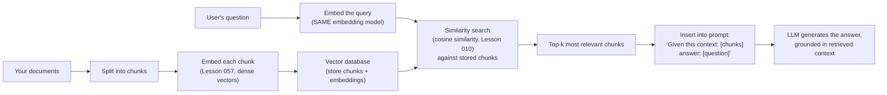

# 01 — Concepts: Retrieval-Augmented Generation

## The problem RAG solves

An LLM's knowledge is frozen at whatever its training data contained — it
knows nothing about documents created after training, your private files,
or anything simply too obscure to have been well-represented in training
data. Fine-tuning (Lesson 069) *can* add knowledge, but is slow, costly,
and needs retraining every time the underlying information changes. **RAG**
instead retrieves relevant information **at query time** and hands it to
the model as context — no retraining needed, ever, even as the underlying
documents change.

## The RAG pipeline



## Step 1: chunking documents

Long documents must be split into smaller pieces (a few hundred tokens
each is common) — an entire book can't fit in an LLM's context window
(Lesson 060's `max_len`/`block_size`), and retrieval works better on
focused chunks than one giant embedding representing an entire document's
mixed content.

```python
def chunk_text(text, chunk_size=200, overlap=50):
    words = text.split()
    chunks = []
    for i in range(0, len(words), chunk_size - overlap):
        chunks.append(" ".join(words[i:i+chunk_size]))
    return chunks
```

`overlap` prevents a fact from being awkwardly split exactly at a chunk
boundary and becoming unretrievable from either side.

## Step 2: embedding chunks and queries

Both documents and queries are converted to dense vectors using the
**same** embedding model (Lesson 057's word embeddings, generalized to
whole-passage/sentence embeddings — models like `sentence-transformers`
are specifically trained to produce good passage-level embeddings for
exactly this purpose):

```python
from sentence_transformers import SentenceTransformer

embedder = SentenceTransformer("all-MiniLM-L6-v2")
chunk_embeddings = embedder.encode(chunks)
query_embedding = embedder.encode([user_question])
```

## Step 3: similarity search (Lesson 010, directly)

```python
from sklearn.metrics.pairwise import cosine_similarity

similarities = cosine_similarity(query_embedding, chunk_embeddings)[0]
top_k_indices = similarities.argsort()[-3:][::-1]   # top 3 most similar chunks
relevant_chunks = [chunks[i] for i in top_k_indices]
```

At real scale (millions of chunks), exact cosine similarity over every
chunk becomes too slow — **vector databases** (Pinecone, Weaviate, or
`faiss` for a local/open-source option) use approximate nearest-neighbor
search structures to make this fast at scale, trading a small amount of
retrieval accuracy for large speed gains.

## Step 4: prompting the LLM with retrieved context

```python
prompt = f"""Answer the question using only the context below. If the context doesn't contain the answer, say so.

Context:
{chr(10).join(relevant_chunks)}

Question: {user_question}
Answer:"""

response = llm.generate(prompt)
```

The instruction "using only the context" (and "say so" if it's missing)
is a real, important prompt-engineering detail — without it, the model
may fall back on its own (potentially outdated or simply wrong for your
specific documents) pretrained knowledge instead of the retrieved
context, undermining the entire point of RAG.

## Why RAG reduces (but doesn't eliminate) hallucination

Grounding generation in retrieved, verifiable text substantially reduces
confident-but-wrong outputs compared to relying purely on the model's
parametric memory — but doesn't eliminate the risk entirely: the model
can still misread, misquote, or over-generalize from the retrieved
context, and retrieval itself can fail (returning irrelevant chunks for
an ambiguous or poorly-matched query). "RAG" is a mitigation, not a
guarantee of factual correctness — worth stating explicitly rather than
overselling.

## Evaluating a RAG system

Two separate things to measure:
1. **Retrieval quality**: did the system find the actually-relevant
   chunks? (Precision/recall over "is this a relevant chunk," Lesson 018.)
2. **Generation quality given good retrieval**: given the *correct*
   context was retrieved, did the model produce a correct, well-grounded
   answer? (Lesson 073's evaluation approaches, or LLM-as-judge.)

A RAG system can fail at either stage independently — debugging requires
checking both, not just looking at final answer quality in isolation.
