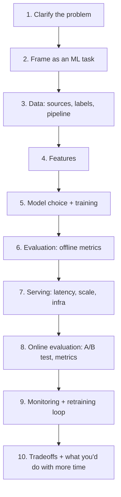

# 01 — Concepts: ML System Design Interview Framework

## Same interview format, one new box in the middle

A traditional system design interview ("design a URL shortener", "design
Twitter's feed") walks through: requirements → API design → data model →
high-level architecture → scaling bottlenecks → tradeoffs. An ML system
design interview walks through the **same shape**, with a model-training-
and-serving pipeline replacing (or augmenting) the plain CRUD/data-store
core. If you've done the former, you already have the muscle memory for
the latter — this lesson is about the ML-specific boxes to slot in.

## A repeatable framework (use this structure out loud, in order)

### 1. Clarify the problem
Same as any system design interview: ask about scale (requests/sec, data
volume), latency requirements (real-time ranking vs. overnight batch
scoring), and — the ML-specific addition — **what "success" means in
business terms** (click-through rate? fraud caught? revenue?), because
that determines the target variable in step 2.

### 2. Frame as an ML task
Turn the business goal into a concrete ML problem: classification,
ranking, regression, generation, anomaly detection. State it explicitly:
"I'll frame this as binary classification: will this user click this
item in the next session, yes/no." This single sentence is the most
commonly skipped step and the one interviewers weight heavily — get it
wrong and everything downstream is built on the wrong foundation.

### 3. Data: sources, labels, pipeline
Where does training data come from? Is it naturally labeled (user
clicked = positive label) or does it need human annotation (Lesson
"assignment" style labeling)? What's the label delay (fraud labels may
arrive weeks after the transaction — a chargeback lag) and how does that
affect how fresh your training data can be?

### 4. Features
What signals are actually available **at prediction time** (not just in
historical logs) — the single most common mistake here is designing a
feature that leaks future information (e.g., "total purchases this
session" when predicting whether the *current* click converts, if the
count includes the click itself). Mention feature stores if scale
warrants it (precomputed features served consistently to both training
and inference — solving exactly the training/serving skew problem).

### 5. Model choice + training
Start simple, justify complexity. "I'd start with logistic
regression/GBDT as a baseline (fast to train, interpretable, strong
baseline per Lesson 030) before reaching for a deep model" is a stronger
answer than jumping straight to a Transformer, because it shows judgment,
not just familiarity with the latest architecture. Only escalate
complexity when you can name the reason (need to model sequences → RNN/
Transformer; need to model images → CNN; need personalization at scale →
embedding-based retrieval, etc).

### 6. Evaluation: offline metrics
Which metric fits the framing from step 2 (Lesson 025's classification
metrics, Lesson 007's regression metrics) — and critically, why accuracy
is often the *wrong* choice for imbalanced problems like fraud detection
(precision/recall/PR-AUC instead, per Lesson 025).

### 7. Serving: latency, scale, infra
This is where Lessons 073–080 plug in directly: batch vs. real-time
inference, caching, model size vs. latency budget, quantization if
latency-constrained, the deployment-target tradeoffs from Lesson 080.

### 8. Online evaluation
Offline metrics don't guarantee business impact — mention A/B testing
the model against the current production system before full rollout, and
name the online metric that maps back to step 1's business goal.

### 9. Monitoring + retraining loop
Data drift (the input distribution changes over time — a fraud model
trained pre-holiday-season may degrade during it), concept drift (the
relationship between features and label changes), and a retraining
cadence/trigger (scheduled retraining vs. drift-triggered retraining).

### 10. Tradeoffs
Every design has them — name at least one explicitly (e.g., "a bigger
model would likely improve offline AUC by X%, but the latency budget
here is 50ms, which rules it out without quantization"). Interviewers are
listening for whether you can reason about tradeoffs, not for a single
"correct" architecture.

## What's genuinely new vs. what transfers

**Transfers directly**: the entire interview *shape* (requirements →
architecture → scale → tradeoffs), API design thinking, data pipeline/
storage reasoning, caching, load balancing — anything you already do in a
backend system design interview.

**Genuinely new**: framing a business goal as an ML task, label sourcing
and leakage awareness, offline-vs-online metric distinction, drift and
retraining loops — the ML-specific vocabulary layered onto a familiar
interview skeleton.
