# AI/ML Roadmap — From Basics to Building Your Own LLM (and Game AI)

This is the master index for the whole curriculum. Every numbered lesson, project, and
assignment on disk is listed here in learning order. Status legend:

- ✅ Created — content exists under `lessons/`, `projects/`, or `assignments/`
- ⏳ Planned — appears here for sequencing, not yet written

See [README.md](README.md) for how the repo is organized and how to use it.
Track your own completion (studied, not just "file exists") in [PROGRESS.md](PROGRESS.md).

Stack: **Python, NumPy, Pandas, Matplotlib/Seaborn, scikit-learn, PyTorch**.

**Three end goals this roadmap is built toward**, each a different flavor of "model
that predicts things":
1. **Text/game prediction via LLMs** — a model that predicts the next token, used for
   text generation, autocomplete, and chat (Modules 10–14).
2. **Text detection/classification** — a model that predicts a label from text (spam,
   sentiment, AI-generated vs. human-written) (Modules 9–10, Projects 011–012).
3. **Game-playing AI** — a model (or search algorithm) that predicts the best move,
   built up from classical search to a self-play neural agent (Module 8, a Chess Bot
   taken through 3 increasingly capable versions).

## Module flow → end goals

```mermaid
flowchart LR
    M0["0 Setup"] --> M1["1 Programming & Data Tools"]
    M1 --> M2["2 Probability & Statistics"]
    M2 --> M3["3 Linear Algebra & Calculus"]
    M3 --> M4["4 Supervised ML"]
    M4 --> M5["5 Unsupervised ML"]
    M4 --> M9["9 NLP Foundations"]
    M5 --> M6["6 NN Foundations"]
    M6 --> M7["7 Vision & Sequences"]
    M6 --> M8["8 RL & Game AI"]
    M7 --> M8
    M9 --> M10["10 Attention & Transformers"]
    M10 --> M11["11 Build Your Own LLM"]
    M11 --> M12["12 Fine-Tuning & Alignment"]
    M12 --> M13["13 Eval, Inference & Serving"]
    M13 --> M14["14 Applications"]

    M8 --> G1(["🎯 Chess Bot\nProjects 008-010"])
    M9 --> G2(["🎯 Text Detection\nProjects 003, 011-012"])
    M14 --> G3(["🎯 Your Own LLM\nProject 015"])
    G1 --> M15["15 Productionization &\nCareer Transition"]
    G2 --> M15
    G3 --> M15
    M15 --> G4(["🎯 AI/ML Developer Job\nsee career-transition.md"])
```

---

## Module 0 — Setup

| # | Lesson | Status |
|---|--------|--------|
| 001 | Environment & Python Setup | ✅ |

## Module 1 — Programming & Data Tools

| # | Lesson | Status |
|---|--------|--------|
| 002 | Python Fundamentals & Data Structures | ✅ |
| 003 | NumPy Fundamentals | ✅ |
| 004 | Pandas Fundamentals | ✅ |
| 005 | Data Visualization (Matplotlib/Seaborn) | ✅ |

**Project 001** — Retail Sales Exploratory Data Analysis *(builds on lessons 001–005)* — ✅

## Module 2 — Probability & Statistics

| # | Lesson | Status |
|---|--------|--------|
| 006 | Probability Basics | ✅ |
| 007 | Probability Distributions | ✅ |
| 008 | Descriptive Statistics | ✅ |
| 009 | Inferential Statistics & Hypothesis Testing | ✅ |

**Assignment 001** — Python + NumPy + Pandas + Probability drills *(builds on lessons 001–008)* — ✅

## Module 3 — Linear Algebra & Calculus (Math for ML)

| # | Lesson | Status |
|---|--------|--------|
| 010 | Linear Algebra — Vectors & Vector Spaces | ✅ |
| 011 | Linear Algebra — Matrices & Operations | ✅ |
| 012 | Linear Algebra — Eigenvalues, Eigenvectors, SVD | ✅ |
| 013 | Calculus — Derivatives & Chain Rule | ✅ |
| 014 | Calculus — Partial Derivatives, Gradients, Jacobians | ✅ |
| 015 | Gradient Descent (Batch/Stochastic/Mini-batch) | ✅ |
| 016 | Information Theory — Entropy, Cross-Entropy, KL Divergence | ✅ |
| 017 | Bias-Variance Tradeoff | ✅ |
| 018 | Evaluation Metrics (Regression & Classification) | ✅ |
| 019 | Curse of Dimensionality | ✅ |

**Project 002** — Gradient Descent From Scratch on Real Housing Data *(builds on lessons 010–015)* — ✅

## Module 4 — Supervised Machine Learning

| # | Lesson | Status |
|---|--------|--------|
| 020 | Linear Regression (math + scikit-learn) | ✅ |
| 021 | Multiple Linear Regression & Assumptions | ✅ |
| 022 | Polynomial Regression & Regularization (Ridge/Lasso) | ✅ |
| 023 | Logistic Regression | ✅ |
| 024 | Classification Metrics (Precision/Recall/ROC-AUC) | ✅ |
| 025 | K-Nearest Neighbors | ✅ |
| 026 | Decision Trees | ✅ |
| 027 | Ensemble Methods — Bagging & Random Forests | ✅ |
| 028 | Boosting — AdaBoost, Gradient Boosting, XGBoost | ✅ |
| 029 | Support Vector Machines | ✅ |
| 030 | Naive Bayes | ✅ |

**Assignment 002** — Classification on a real dataset (Titanic-style) *(builds on lessons 020–024)* — ✅
**Project 003** — Spam & Fake Review Detector — classical text classification with TF-IDF + Naive Bayes/Logistic Regression *(builds on lessons 023–030; first "predict a label from text" project)* — ✅
**Project 004** — End-to-End Customer Churn Prediction *(builds on lessons 020–030)* — ✅

## Module 5 — Unsupervised Machine Learning

| # | Lesson | Status |
|---|--------|--------|
| 031 | Principal Component Analysis (PCA) | ✅ |
| 032 | K-Means Clustering | ✅ |
| 033 | Hierarchical Clustering | ✅ |
| 034 | DBSCAN | ✅ |

**Project 005** — Customer Segmentation *(builds on lessons 031–034)* — ✅

## Module 6 — Neural Network Foundations

| # | Lesson | Status |
|---|--------|--------|
| 035 | Perceptron & Multi-Layer Perceptron | ✅ |
| 036 | Activation Functions & Softmax | ✅ |
| 037 | Backpropagation — The Math | ✅ |
| 038 | Neural Network From Scratch (NumPy only) — micrograd-style: build backprop by hand before using autograd | ✅ |
| 039 | PyTorch Fundamentals — Tensors & Autograd | ✅ |
| 040 | Building & Training a Neural Net in PyTorch | ✅ |
| 041 | Optimizers — SGD, Momentum, RMSProp, Adam | ✅ |
| 042 | Regularization — Dropout & BatchNorm | ✅ |

**Assignment 003** — Implement backprop + a 2-layer NN from scratch *(builds on lessons 035–038)* — ✅
**Project 006** — Image Classifier (intro CNN) *(builds on lessons 039–042)* — ✅

## Module 7 — Deep Learning for Vision & Sequences

| # | Lesson | Status |
|---|--------|--------|
| 043 | CNN Fundamentals | ✅ |
| 044 | CNN Architectures (LeNet/VGG/ResNet ideas) | ✅ |
| 045 | RNN Fundamentals | ✅ |
| 046 | LSTM & GRU | ✅ |
| 047 | Seq2Seq & Encoder-Decoder | ✅ |

**Project 007** — Time-Series Forecasting with RNN/LSTM *(builds on lessons 045–047)* — ✅

## Module 8 — Reinforcement Learning & Game AI (→ Chess Bot)

Everything needed to go from "a model that predicts a label" to "an agent that
predicts the best move." Chess is the running example, taken through three
increasingly capable versions rather than one big leap.

| # | Lesson | Status |
|---|--------|--------|
| 048 | Game Trees & Minimax | ✅ |
| 049 | Alpha-Beta Pruning & Heuristic Evaluation Functions | ✅ |
| 050 | Intro to Reinforcement Learning — MDPs, Reward, Policy, Value | ✅ |
| 051 | Q-Learning & Value Iteration | ✅ |
| 052 | Policy Gradients (REINFORCE) & Actor-Critic Basics | ✅ |
| 053 | Monte Carlo Tree Search (MCTS) | ✅ |
| 054 | Self-Play & AlphaZero-Style Training | ✅ |

**Assignment 004** — Implement minimax + alpha-beta for Tic-Tac-Toe *(builds on lessons 048–049; warm-up before chess-scale search)* — ✅
**Project 008** — Chess Bot v1: Minimax + Alpha-Beta with a hand-crafted evaluation function *(builds on lessons 048–049; classical AI, no learning yet)* — ✅
**Project 009** — Chess Bot v2: swap the hand-crafted evaluation for a CNN position evaluator trained on labeled positions *(builds on lessons 039–044, 048–049)* — ✅
**Project 010 (capstone-lite)** — Chess Bot v3: self-play reinforcement learning guided by MCTS, AlphaZero-style *(builds on lessons 050–054)* — ✅

## Module 9 — NLP Foundations

| # | Lesson | Status |
|---|--------|--------|
| 055 | Text Preprocessing & Tokenization | ✅ |
| 056 | Bag-of-Words & TF-IDF | ✅ |
| 057 | Word Embeddings — Word2Vec & GloVe | ✅ |

**Project 011** — Text Classifier: Spam / AI-Generated Text Detector, baseline version *(builds on lessons 055–057 + Project 003's classical classifier; "predict whether this text is real/fake/human/AI")* — ✅

## Module 10 — Attention & Transformers

| # | Lesson | Status |
|---|--------|--------|
| 058 | The Attention Mechanism | ✅ |
| 059 | Multi-Head Self-Attention | ✅ |
| 060 | The Transformer Architecture (full) | ✅ |
| 061 | Positional Encoding — Sinusoidal & RoPE | ✅ |
| 062 | Tokenization for LLMs — BPE & SentencePiece | ✅ |

**Assignment 005** — Implement scaled dot-product + multi-head attention from scratch *(builds on lessons 058–059)* — ✅
**Project 012** — Upgrade the Project 011 text detector with a fine-tuned Transformer (Hugging Face) *(builds on lessons 055–062)* — ✅

## Module 11 — Building Your Own LLM

Taught Karpathy-style: build every piece from scratch in plain PyTorch first
(no `transformers` library shortcuts), starting character-level, before ever
touching a pretrained model. See [Andrej Karpathy resources](README.md#andrej-karpathy--build-your-own-llm) —
this module follows the same progression as his "Zero to Hero" series and
`nanoGPT`.

| # | Lesson | Status |
|---|--------|--------|
| 063 | Language Modeling Objective — Cross-Entropy & Perplexity | ✅ |
| 063a | Bigram & Simple MLP Character-Level Language Models (`makemore`-style warm-up) | ✅ |
| 064 | Build a GPT From Scratch — Part 1: Architecture (self-attention block by hand) | ✅ |
| 065 | Build a GPT From Scratch — Part 2: Training Loop | ✅ |
| 066 | Build a GPT From Scratch — Part 3: Sampling & Generation | ✅ |
| 067 | Scaling — Mixed Precision, Gradient Accumulation, Checkpointing | ✅ |
| 068 | Scaling Laws & Compute Budgeting | ✅ |
| 068a | Byte-Pair Encoding From Scratch (`minbpe`-style — replace the char-level tokenizer) | ✅ |

**Project 013** — Train a Small Character/Word-Level GPT on a Custom Corpus (capstone-lite), nanoGPT-style — this is where "predict the next word" (autocomplete) becomes a real, working model *(builds on lessons 063–068a)* — ✅

## Module 12 — Fine-Tuning & Alignment

| # | Lesson | Status |
|---|--------|--------|
| 069 | Transfer Learning & Fine-Tuning Pretrained LLMs | ✅ |
| 070 | Parameter-Efficient Fine-Tuning — LoRA & QLoRA | ✅ |
| 071 | Instruction Tuning | ✅ |
| 072 | Alignment Basics — RLHF & DPO | ✅ |

**Assignment 006** — Fine-tune a small open LLM with LoRA on a custom dataset *(builds on lessons 069–071)* — ✅

## Module 13 — Evaluation, Inference & Serving

| # | Lesson | Status |
|---|--------|--------|
| 073 | LLM Evaluation — Perplexity & Benchmarks | ✅ |
| 074 | Inference Optimization — KV-Cache, Quantization, Speculative Decoding | ✅ |
| 075 | Serving LLMs — vLLM / llama.cpp Basics | ✅ |

## Module 14 — Applications

| # | Lesson | Status |
|---|--------|--------|
| 076 | Retrieval-Augmented Generation (RAG) | ✅ |
| 077 | Agents & Tool Use | ✅ |

**Project 014** — RAG-Powered Assistant Over Your Own Documents *(builds on lessons 073–076)* — ✅
**Project 015 (Capstone)** — Build Your Own LLM End-to-End: tokenizer → pretrain → fine-tune → serve via a chat API *(builds on all of Modules 11–14)* — ✅

## Module 15 — Productionization & Career Transition

For developers coming from full-stack web development specifically: this is
where your existing Node/Java/React skills become a direct advantage instead
of a thing to set aside. Full detail, portfolio milestones, and interview-prep
links live in [career-transition.md](career-transition.md) — this table is
just the numbered lesson index.

| # | Lesson | Status |
|---|--------|--------|
| 078 | Serving a Model as a REST API (FastAPI) — mapped to Express/Spring concepts you already know | ✅ |
| 079 | Containerizing ML Apps with Docker | ✅ |
| 080 | Deploying an Inference Endpoint to the Cloud | ✅ |
| 081 | ML System Design Interview Prep | ✅ |
| 082 | ML/DS Coding Interview Prep (DSA + ML-specific questions) | ✅ |

**Assignment 007** — Answer 5 ML system design interview questions in writing, then get them reviewed *(builds on lesson 081)* — ✅
**Project 016** — Full-Stack AI App: a React/Angular frontend + Node or FastAPI backend serving one of your own trained models, deployed live *(builds on lessons 078–080 + any earlier model, e.g. Project 013's GPT or Project 011/012's text detector; the portfolio centerpiece that plays directly to your existing stack)* — ✅

---

## Math Coverage Map (why each math lesson exists)

| Math area | Lessons | Used for |
|---|---|---|
| Probability & Statistics | 006–009 | Loss functions, Naive Bayes, evaluation, sampling, RLHF reward modeling |
| Linear Algebra | 010–012 | Weight matrices, embeddings, PCA, attention as matrix multiplication |
| Calculus | 013–015 | Backpropagation, gradient descent, optimizers |
| Information Theory | 016 | Cross-entropy loss, perplexity, KL divergence (used again in RLHF/DPO) |
| Bias-Variance / Evaluation | 017–019 | Model selection, under/overfitting diagnosis, choosing metrics |
| MDPs & Reward | 050–052 | Framing "choose the best move/action" as a learnable objective |

## Where each end goal is actually reached

| Goal | Gets built in |
|---|---|
| Game-playing bot (Chess) | Module 8, Projects 008–010 (search → CNN eval → self-play RL) |
| Text detection/classification (spam, AI-generated text) | Module 9–10, Projects 003, 011–012 |
| Autocomplete / text generation (your own LLM) | Module 11, Project 013, then Modules 12–14, Project 015 |

## Reference Links

Curated videos/courses are kept in [README.md](README.md#references) to avoid duplication.

## Next To Do

Lessons 010–019 are the next block to author (Linear Algebra → Calculus →
Gradient Descent → Information Theory → Bias-Variance/Evaluation), followed by Project 002.
Confirmed preference: author strictly in order rather than jumping ahead to
Module 8 (Chess Bot) or Module 15 (career track), even though both are already
fully planned below.
